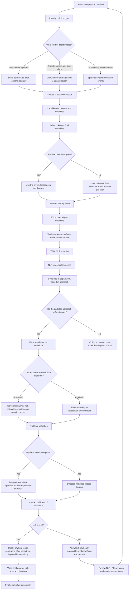

# Mermaid Asset: FA22ElasticCollisionsInOneDimensionMermaid-001

## Asset metadata

| Field | Value |
|---|---|
| Asset ID | FA22ElasticCollisionsInOneDimensionMermaid-001 |
| Asset type | Mermaid flowchart |
| Lesson file | FA22_elastic_collisions_in_one_dimension_lesson.md |
| Related lesson section | Section 9.1 Method flow diagram; Section 8 Core Theory; Section 15 Exam Technique Notes |
| Used placeholder | `[VISUAL PLACEHOLDER: FA22ElasticCollisionsInOneDimensionMermaid-001 | Source: CCEA FA22-REST boundary + transcript explanation of PCLM and NLR | Insert from mermaid/FA22ElasticCollisionsInOneDimensionMermaid-001.md | Purpose: Show the full solution flow for direct collision questions.]` |
| Source | CCEA FA22-REST boundary + lesson transcript explanation of PCLM and NLR |
| Purpose | Show the full solution flow for direct one-dimensional collision questions using PCLM and Newton's Law of Restitution. |
| Status | Generated in Phase 2 |

## Mermaid code

