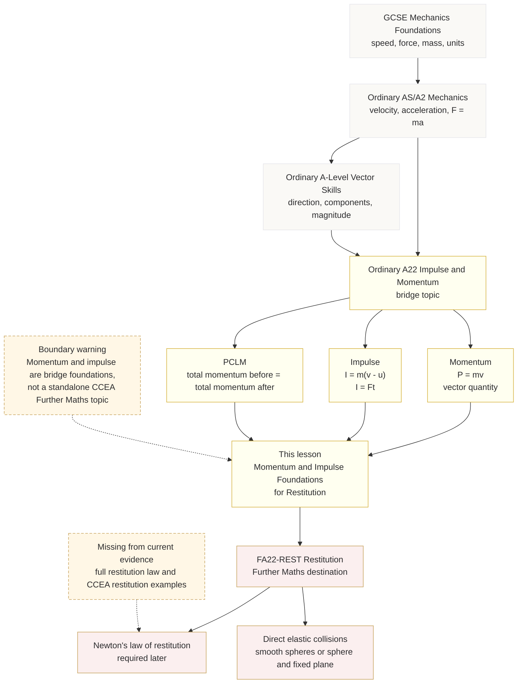

# Mermaid Asset: FA22MomentumImpulseFoundationsForRestitutionMermaid-001

## Asset Metadata

| Field | Value |
|---|---|
| Asset ID | `FA22MomentumImpulseFoundationsForRestitutionMermaid-001` |
| Asset type | Mermaid diagram |
| Topic ID | `FA22MomentumImpulseFoundationsForRestitution` |
| Lesson file | `FA22_momentum_impulse_foundations_for_restitution_lesson.md` |
| Related lesson section | Section 9: Visual Asset Integration |
| Used placeholder | `[VISUAL PLACEHOLDER: FA22MomentumImpulseFoundationsForRestitutionMermaid-001 | Source: CCEA Further Mathematics specification boundary + Ordinary A-Level Maths bridge sources + supplied momentum/impulse evidence | Insert from mermaid/FA22MomentumImpulseFoundationsForRestitutionMermaid-001.md | Purpose: Show the course pathway from ordinary A22 Impulse and Momentum into FA22 Restitution. Description: The diagram should show GCSE/AS mechanics foundations feeding into ordinary A22 impulse and momentum, then into FA22 Restitution. It must mark momentum/impulse as bridge content and restitution as the Further Maths destination.]` |
| Source | CCEA Further Mathematics specification boundary + Ordinary A-Level Maths bridge sources + supplied momentum/impulse evidence |
| Purpose | Show the pathway from ordinary A-Level mechanics foundations into FA22 Restitution. |
| Boundary note | Momentum and impulse are shown as bridge/prerequisite content, not as a standalone CCEA Further Mathematics topic. |

## Creation Notes

This diagram helps the student see that GCSE and ordinary A-Level mechanics introduce motion, force and vector ideas; ordinary A22 Impulse and Momentum develops \(P=mv\), \(I=m(v-u)\), \(I=Ft\) and PCLM; and FA22 Restitution is the Further Maths destination.

## Mermaid Code

