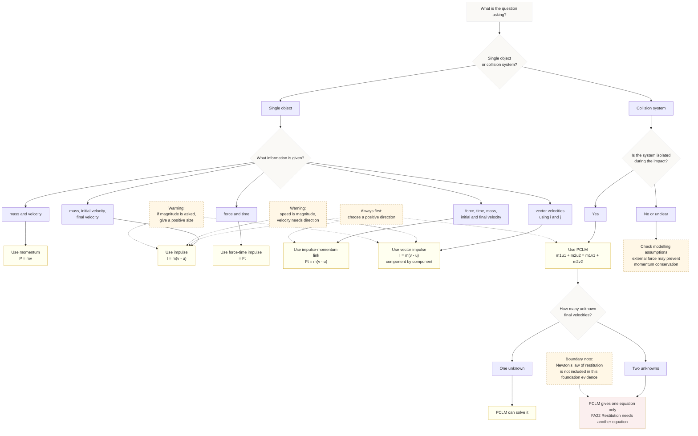

# Mermaid Asset: FA22MomentumImpulseFoundationsForRestitutionMermaid-002

## Asset Metadata

| Field | Value |
|---|---|
| Asset ID | `FA22MomentumImpulseFoundationsForRestitutionMermaid-002` |
| Asset type | Mermaid diagram |
| Topic ID | `FA22MomentumImpulseFoundationsForRestitution` |
| Lesson file | `FA22_momentum_impulse_foundations_for_restitution_lesson.md` |
| Related lesson section | Section 9: Visual Asset Integration |
| Used placeholder | `[VISUAL PLACEHOLDER: FA22MomentumImpulseFoundationsForRestitutionMermaid-002 | Source: FM1-Chp1-Momentum.pdf and transcripts.md | Insert from mermaid/FA22MomentumImpulseFoundationsForRestitutionMermaid-002.md | Purpose: Help students choose between \(I=m(v-u)\), \(I=Ft\), and PCLM. Description: The flowchart should begin with “What is asked?” and branch to impulse from velocity change, force-time impulse, conservation of momentum, or vector component method.]` |
| Source | `FM1-Chp1-Momentum.pdf` and `transcripts.md` |
| Purpose | Help students choose the correct method: \(P=mv\), \(I=m(v-u)\), \(I=Ft\), \(Ft=m(v-u)\), PCLM, or vector impulse. |
| Boundary note | This is a bridge/prerequisite method selector for FA22 Restitution readiness. |

## Mermaid Code

