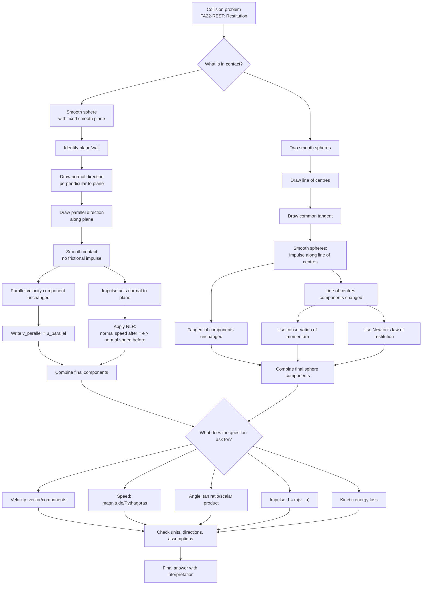

# Mermaid Asset: FA22RestitutionElasticCollisionsInTwoDimensionsMermaid-001

## Asset metadata

| Field | Value |
|---|---|
| Asset ID | `FA22RestitutionElasticCollisionsInTwoDimensionsMermaid-001` |
| File path | `mermaid/FA22RestitutionElasticCollisionsInTwoDimensionsMermaid-001.md` |
| Topic ID | `FA22RestitutionElasticCollisionsInTwoDimensions` |
| Unit | `FA22` |
| Topic code | `FA22-REST` |
| Related lesson file | `FA22_restitution_elastic_collisions_in_two_dimensions_lesson.md` |
| Related lesson section | Section 9: Visual Asset Integration; Section 8: Core Theory; Section 15: Exam Technique Notes |
| Used placeholder | `[VISUAL PLACEHOLDER: FA22RestitutionElasticCollisionsInTwoDimensionsMermaid-001 | Source: CCEA FA22-REST specification boundary + lesson evidence | Insert from mermaid/FA22RestitutionElasticCollisionsInTwoDimensionsMermaid-001.md | Purpose: Show the decision flow from “smooth impact” to “resolve components” to “apply Newton’s law of restitution”.]` |
| Source | CCEA FA22-REST lesson boundary + lesson evidence from `FM1-Chp5-ObliqueCollisions.pdf` and `transcripts.md` |
| Purpose | Show the decision flow from smooth impact assumptions to component resolution, Newton’s law of restitution, conservation of momentum where needed, and final interpretation. |

## Creation notes

This flowchart is designed as the lesson’s collision compass.

## Mermaid code

