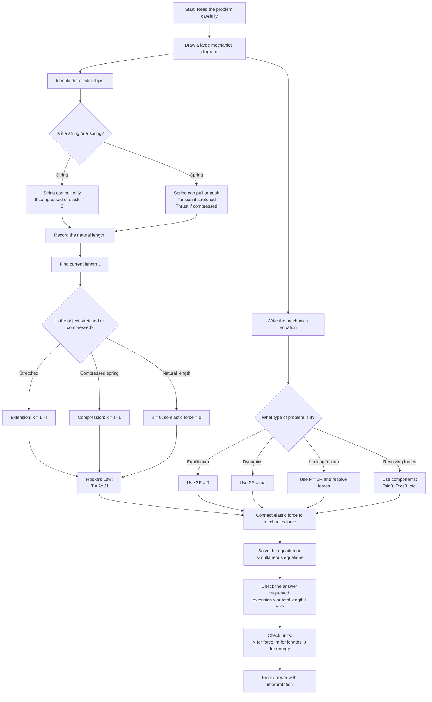

# Mermaid Asset: FAS2HookesLawElasticStringsAndSpringsMermaid-001

## Asset metadata

| Field | Value |
|---|---|
| Asset ID | `FAS2HookesLawElasticStringsAndSpringsMermaid-001` |
| Asset type | Mermaid flowchart |
| Source | CCEA Further Mathematics specification map + FM1 Elastic Strings and Springs lesson evidence |
| Related lesson section | Section 8: Core Theory; Section 15: Exam Technique Notes |
| Used placeholder | `FAS2HookesLawElasticStringsAndSpringsMermaid-001` |
| Purpose | Show the standard two-equation method for Hooke's Law problems. |
| Creation notes | AI-proposed teaching visual based on the evidence-backed method. |

## Mermaid code

