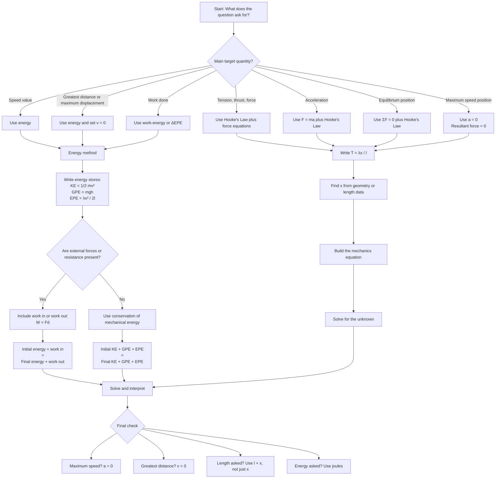

# Mermaid Asset: FAS2HookesLawElasticStringsAndSpringsMermaid-002

## Asset metadata

| Field | Value |
|---|---|
| Asset ID | `FAS2HookesLawElasticStringsAndSpringsMermaid-002` |
| Asset type | Mermaid decision tree |
| Source | FM1 Elastic Strings and Springs problem-solving evidence + linked CCEA `FAS2-WENG` work-energy boundary |
| Related lesson section | Section 8.17: When to use energy instead; Section 15.5: Choosing equations |
| Used placeholder | `FAS2HookesLawElasticStringsAndSpringsMermaid-002` |
| Purpose | Help students choose between Hooke's Law with force equations and the work-energy method. |
| Creation notes | Preserves the method distinction: acceleration and force need force equations; speed, distance and work usually call for energy. |

## Mermaid code

