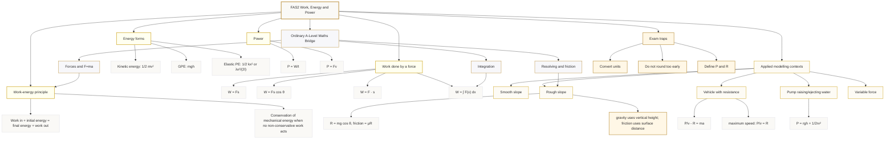

# FAS2WorkEnergyAndPowerMermaid-001

```mermaid
flowchart TD
    A["FAS2 Work, Energy and Power"]:::main
    A --> B["Work done by a force"]:::core
    A --> C["Energy forms"]:::core
    A --> D["Work-energy principle"]:::core
    A --> E["Power"]:::core
    A --> F["Applied modelling contexts"]:::applied
    B --> B1["W = Fs"]:::formula
    B --> B2["W = Fs cos θ"]:::formula
    B --> B3["W = F · s"]:::formula
    B --> B4["W = ∫ F(x) dx"]:::formula
    C --> C1["Kinetic energy: 1/2 mv²"]:::formula
    C --> C2["GPE: mgh"]:::formula
    C --> C3["Elastic PE: 1/2 kx² or λx²/(2l)"]:::formula
    D --> D1["Work in + initial energy = final energy + work out"]:::formula
    D --> D2["Conservation of mechanical energy when no non-conservative work acts"]:::formula
    E --> E1["P = W/t"]:::formula
    E --> E2["P = Fv"]:::formula
    F --> F1["Smooth slope"]:::applied
    F --> F2["Rough slope"]:::applied
    F --> F3["Vehicle with resistance"]:::applied
    F --> F4["Pump raising/ejecting water"]:::applied
    F --> F5["Variable force"]:::applied
    F2 --> F2a["R = mg cos θ, friction = μR"]:::formula
    F2 --> F2b["gravity uses vertical height; friction uses surface distance"]:::warning
    F3 --> F3a["P/v - R = ma"]:::formula
    F3 --> F3b["maximum speed: P/v = R"]:::formula
    F4 --> F4a["P = rgh + 1/2rv²"]:::formula
    G["Ordinary A-Level Maths Bridge"]:::bridge
    G --> G1["Forces and F=ma"]:::bridge
    G --> G2["Resolving and friction"]:::bridge
    G --> G3["Integration"]:::bridge
    G1 --> D
    G2 --> F2
    G3 --> B4
    H["Exam traps"]:::warning
    H --> H1["Convert units"]:::warning
    H --> H2["Do not round too early"]:::warning
    H --> H3["Define P and R"]:::warning
    A --> G
    A --> H
    classDef main fill:#FAF9F6,stroke:#C5A059,stroke-width:3px,color:#2C2C2E;
    classDef core fill:#FFFFF0,stroke:#D4AF37,stroke-width:2px,color:#2C2C2E;
    classDef formula fill:#FAF9F6,stroke:#E5E5EA,stroke-width:1.5px,color:#2C2C2E;
    classDef warning fill:#FFF7E6,stroke:#C5A059,stroke-width:2px,color:#2C2C2E;
    classDef bridge fill:#F7F7FA,stroke:#C5A059,stroke-width:1.5px,color:#2C2C2E;
    classDef applied fill:#FDFBF5,stroke:#D4AF37,stroke-width:1.5px,color:#2C2C2E;
```
