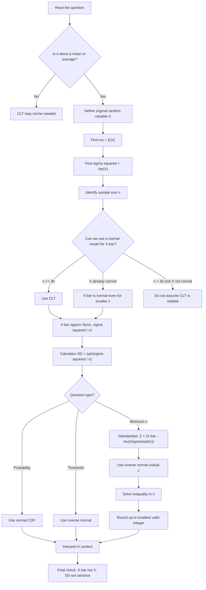

# Mermaid Asset: FA22CentralLimitTheoremMermaid-001

## Asset metadata

| Field | Value |
|---|---|
| Asset ID | `FA22CentralLimitTheoremMermaid-001` |
| Unit | `FA22` |
| Topic ID | `FA22CentralLimitTheorem` |
| Related lesson file | `FA22_central_limit_theorem_lesson.md` |
| Used placeholder | `[VISUAL PLACEHOLDER: FA22CentralLimitTheoremMermaid-001 | Source: CCEA Further Maths specification + transcript method checklist | Insert from mermaid/FA22CentralLimitTheoremMermaid-001.md | Purpose: Give students an exam workflow for deciding when and how to use CLT.]` |
| Purpose | Exam workflow for deciding when and how to use CLT. |

