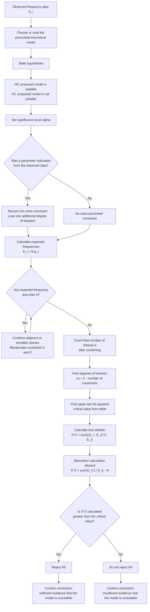

# Mermaid Asset: FA22ChiSquaredTestsMermaid-001

## Asset metadata

| Field | Value |
|---|---|
| Asset ID | FA22ChiSquaredTestsMermaid-001 |
| Topic ID | FA22ChiSquaredTests |
| Unit | FA22: Further A2 2 Applied Mathematics |
| Applied section | Section C: Statistics |
| Topic code | FA22-CHI2 |
| Related lesson file | FA22_chi_squared_tests_lesson.md |
| Related lesson section | # 9. Visual Asset Integration |
| Used placeholder | `[VISUAL PLACEHOLDER: FA22ChiSquaredTestsMermaid-001 | Source: CCEA FA22-CHI2 specification + Dr Frost goodness-of-fit workflow evidence | Insert from mermaid/FA22ChiSquaredTestsMermaid-001.md | Purpose: Show the complete goodness-of-fit decision chain from model choice to final conclusion.]` |
| Source | CCEA FA22-CHI2 specification boundary + Dr Frost goodness-of-fit workflow evidence + teacher transcript |
| Purpose | Show the complete goodness-of-fit decision chain from model choice to final conclusion. |
| Status | Generated in Phase 2 |

## Mermaid code

