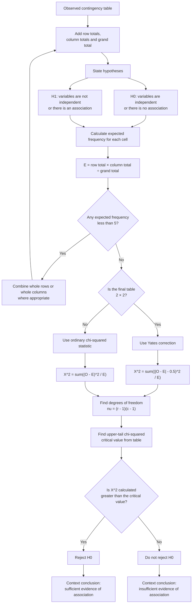

# Mermaid Asset: FA22ChiSquaredTestsMermaid-002

## Asset metadata

| Field | Value |
|---|---|
| Asset ID | FA22ChiSquaredTestsMermaid-002 |
| Topic ID | FA22ChiSquaredTests |
| Unit | FA22: Further A2 2 Applied Mathematics |
| Applied section | Section C: Statistics |
| Topic code | FA22-CHI2 |
| Related lesson file | FA22_chi_squared_tests_lesson.md |
| Related lesson section | # 9. Visual Asset Integration |
| Used placeholder | `[VISUAL PLACEHOLDER: FA22ChiSquaredTestsMermaid-002 | Source: CCEA FA22-CHI2 specification + contingency table evidence | Insert from mermaid/FA22ChiSquaredTestsMermaid-002.md | Purpose: Show the contingency-table independence test workflow, including the Yates correction branch for \(2\times2\) tables.]` |
| Source | CCEA FA22-CHI2 specification boundary + Dr Frost contingency-table evidence + teacher transcript |
| Purpose | Show the contingency-table independence test workflow, including the Yates correction branch for \(2\times2\) tables. |
| Status | Generated in Phase 2 |

## Mermaid code

