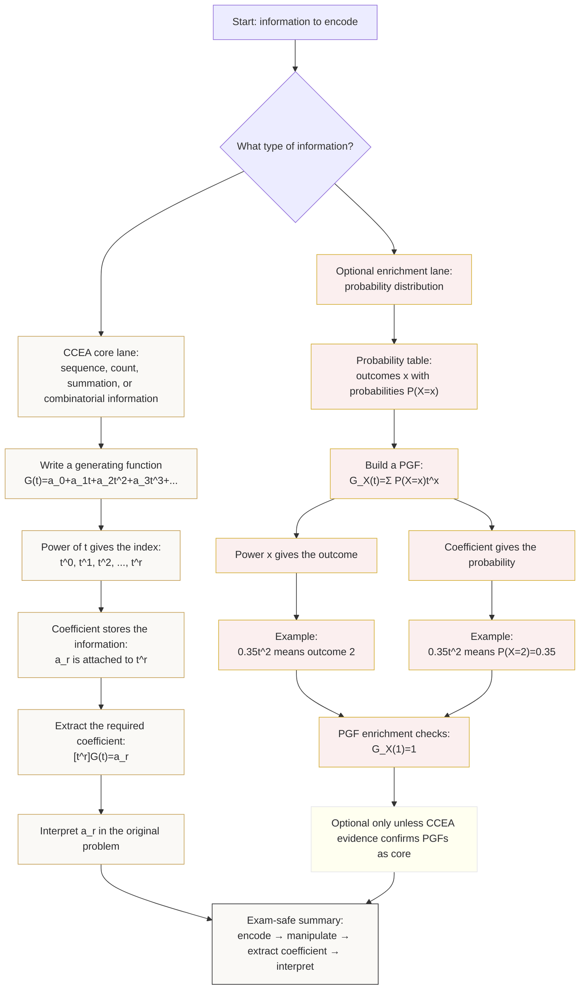

# Mermaid Asset: FA22GeneratingFunctionsMermaid-001

## Asset metadata

| Field | Value |
|---|---|
| Asset ID | `FA22GeneratingFunctionsMermaid-001` |
| Unit | `FA22` – Further A2 2 Applied Mathematics |
| Applied section | Section D: Discrete and Decision Mathematics |
| Topic code | `FA22-GENFUNC` |
| Topic name | Generating functions |
| Topic ID | `FA22GeneratingFunctions` |
| Related lesson file | `FA22_generating_functions_lesson.md` |
| Related lesson section | `# 9. Visual Asset Integration` |
| Used placeholder | `[VISUAL PLACEHOLDER: FA22GeneratingFunctionsMermaid-001 | Source: CCEA FA22-GENFUNC boundary + supplied PGF enrichment evidence | Insert from mermaid/FA22GeneratingFunctionsMermaid-001.md | Purpose: Show the flow from encoded information to generating function to coefficient extraction. The visual must show: sequence/table → powers of t → coefficients → extract [t^r]G(t) → interpret answer.]` |
| Source | CCEA FA22-GENFUNC boundary + supplied PGF enrichment evidence |
| Source status | CCEA core for general generating functions; PGF pathway is optional enrichment only |
| Purpose | Show the flow from encoded information to generating function to coefficient extraction, while clearly separating CCEA core generating functions from optional PGF enrichment. |

## Creation notes

This diagram is designed as the main conceptual map for the lesson.

## Mermaid code

