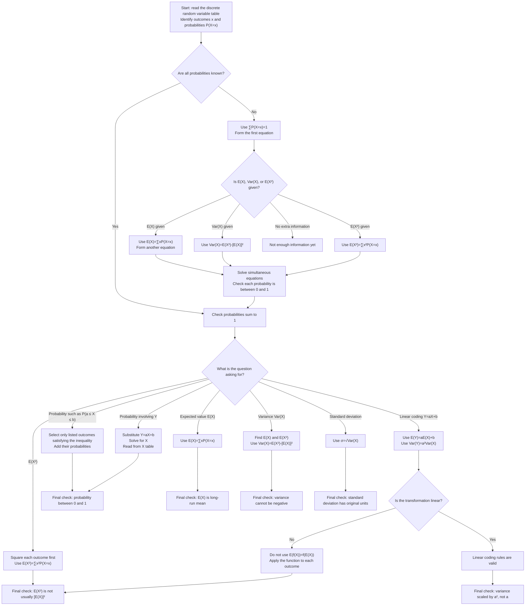

# Mermaid Asset: FAS2DiscreteRandomVariablesMermaid-001

## Asset Metadata

| Field | Value |
|---|---|
| Asset ID | `FAS2DiscreteRandomVariablesMermaid-001` |
| Asset type | Mermaid flowchart |
| Source | CCEA FAS2-DIST specification boundary + uploaded transcript method flow + Phase 1 lesson structure |
| Related lesson section | `# 9. Visual Asset Integration`, `# 8. Core Theory`, `# 15. Exam Technique Notes` |
| Used placeholder | `FAS2DiscreteRandomVariablesMermaid-001` |
| Purpose | Show the decision pathway for solving a discrete random variable table question. |
| Evidence-backed? | AI-proposed visual structure based on evidence-backed methods. |
| CCEA boundary | Supports `FAS2-DIST-LO002`, `FAS2-DIST-LO003`, and `FAS2-DIST-LO006`. |

## Creation Notes

This Mermaid flowchart is designed for the lesson section on discrete random variable method selection.

## Mermaid Code

