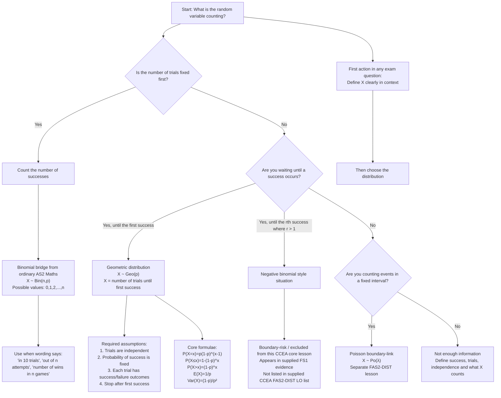

# FAS2GeometricDistributionMermaid-001

```mermaid
flowchart TD
    A["Start: What is the random variable counting?"] --> B{"Is the number of trials fixed first?"}
    B -- "Yes" --> C["Count the number of successes"]
    C --> D["Binomial bridge from ordinary AS2 Maths<br/>X ~ Bin(n,p)<br/>Possible values: 0,1,2,...,n"]
    D --> DNote["Use when wording says:<br/>'in 10 trials', 'out of n attempts', 'number of wins in n games'"]
    B -- "No" --> E{"Are you waiting until a success occurs?"}
    E -- "Yes, until the first success" --> F["Geometric distribution<br/>X ~ Geo(p)<br/>X = number of trials until first success"]
    F --> FCond["Required assumptions:<br/>1. Trials are independent<br/>2. Probability of success is fixed<br/>3. Each trial has success/failure outcomes<br/>4. Stop after first success"]
    F --> FFormula["Core formulae:<br/>P(X=x)=p(1-p)^(x-1)<br/>P(X≤x)=1-(1-p)^x<br/>P(X>x)=(1-p)^x<br/>E(X)=1/p<br/>Var(X)=(1-p)/p²"]
    E -- "Yes, until the rth success where r > 1" --> G["Negative binomial style situation"]
    G --> GWarn["Boundary-risk / excluded from this CCEA core lesson<br/>Appears in supplied FS1 evidence<br/>Not listed in supplied CCEA FAS2-DIST LO list"]
    E -- "No" --> H{"Are you counting events in a fixed interval?"}
    H -- "Yes" --> I["Poisson boundary-link<br/>X ~ Po(λ)<br/>Separate FAS2-DIST lesson"]
    H -- "No" --> J["Not enough information<br/>Define success, trials, independence and what X counts"]
    A --> K["First action in any exam question:<br/>Define X clearly in context"]
    K --> L["Then choose the distribution"]
```
