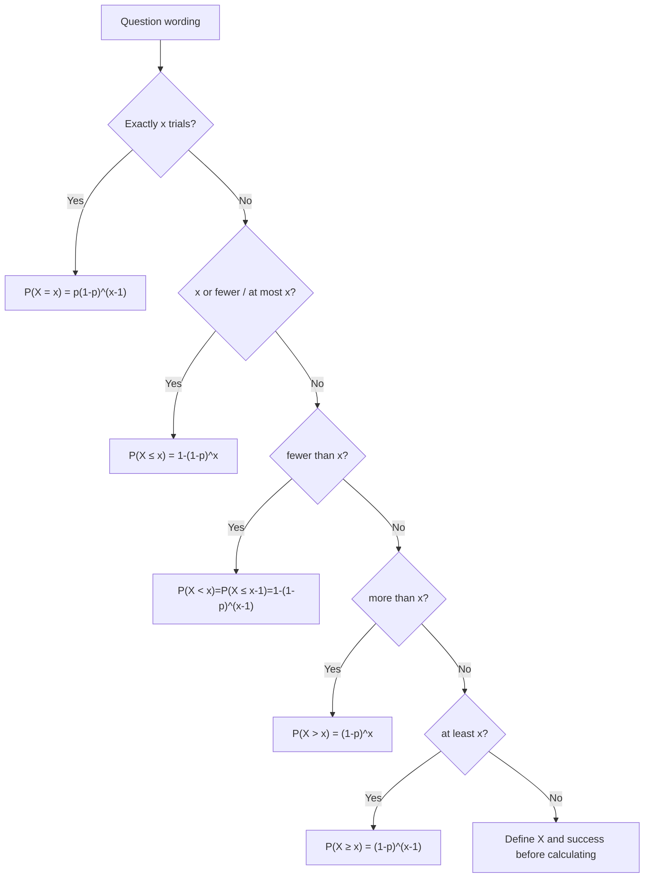

# FAS2GeometricDistributionMermaid-002

```mermaid
flowchart TD
    A["Question wording"] --> B{"Exactly x trials?"}
    B -- "Yes" --> C["P(X = x) = p(1-p)^(x-1)"]
    B -- "No" --> D{"x or fewer / at most x?"}
    D -- "Yes" --> E["P(X ≤ x) = 1-(1-p)^x"]
    D -- "No" --> F{"fewer than x?"}
    F -- "Yes" --> G["P(X < x)=P(X ≤ x-1)=1-(1-p)^(x-1)"]
    F -- "No" --> H{"more than x?"}
    H -- "Yes" --> I["P(X > x) = (1-p)^x"]
    H -- "No" --> J{"at least x?"}
    J -- "Yes" --> K["P(X ≥ x) = (1-p)^(x-1)"]
    J -- "No" --> L["Define X and success before calculating"]
```
