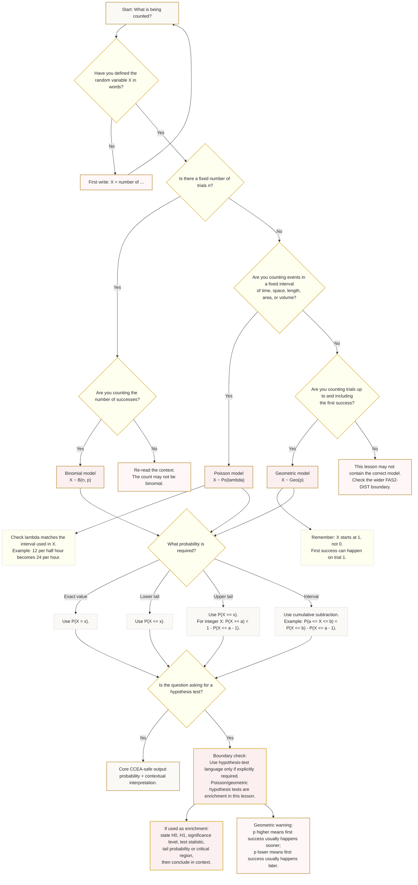

# FAS2StatisticalDistributionsMermaid-001

## Mermaid code

```mermaid
flowchart TD
    A["Start: What is being counted?"]:::start
    A --> B{"Have you defined the random variable X in words?"}:::decision
    B -->|"No"| B1["First write: X = number of ..."]:::warning
    B1 --> A
    B -->|"Yes"| C{"Is there a fixed number of trials n?"}:::decision
    C -->|"Yes"| D{"Are you counting the number of successes?"}:::decision
    D -->|"Yes"| E["Binomial model<br/>X ~ B(n, p)"]:::model
    D -->|"No"| D1["Re-read the context.<br/>The count may not be binomial."]:::warning
    C -->|"No"| F{"Are you counting events in a fixed interval<br/>of time, space, length, area, or volume?"}:::decision
    F -->|"Yes"| G["Poisson model<br/>X ~ Po(lambda)"]:::model
    G --> G1["Check lambda matches the interval used in X.<br/>Example: 12 per half hour becomes 24 per hour."]:::note
    F -->|"No"| H{"Are you counting trials up to and including<br/>the first success?"}:::decision
    H -->|"Yes"| I["Geometric model<br/>X ~ Geo(p)"]:::model
    I --> I1["Remember: X starts at 1, not 0.<br/>First success can happen on trial 1."]:::note
    H -->|"No"| J["This lesson may not contain the correct model.<br/>Check the wider FAS2-DIST boundary."]:::warning
    E --> K{"What probability is required?"}:::decision
    G --> K
    I --> K
    K -->|"Exact value"| L["Use P(X = x)."]:::calc
    K -->|"Lower tail"| M["Use P(X <= x)."]:::calc
    K -->|"Upper tail"| N["Use P(X >= x).<br/>For integer X: P(X >= a) = 1 - P(X <= a - 1)."]:::calc
    K -->|"Interval"| O["Use cumulative subtraction.<br/>Example: P(a <= X <= b) = P(X <= b) - P(X <= a - 1)."]:::calc
    N --> P{"Is the question asking for a hypothesis test?"}:::decision
    M --> P
    O --> P
    L --> P
    P -->|"No"| Q["Core CCEA-safe output:<br/>probability + contextual interpretation."]:::safe
    P -->|"Yes"| R["Boundary check:<br/>Use hypothesis-test language only if explicitly required.<br/>Poisson/geometric hypothesis tests are enrichment in this lesson."]:::enrich
    R --> S["If used as enrichment:<br/>state H0, H1, significance level, test statistic,<br/>tail probability or critical region,<br/>then conclude in context."]:::enrich
    R --> T["Geometric warning:<br/>p higher means first success usually happens sooner;<br/>p lower means first success usually happens later."]:::warning
    classDef start fill:#FAF9F6,stroke:#C5A059,stroke-width:2px,color:#2C2C2E;
    classDef decision fill:#FFFFF0,stroke:#D4AF37,stroke-width:1.5px,color:#2C2C2E;
    classDef model fill:#FBEFEF,stroke:#C5A059,stroke-width:2px,color:#2C2C2E;
    classDef calc fill:#FAF9F6,stroke:#E5E5EA,stroke-width:1.5px,color:#2C2C2E;
    classDef note fill:#FFFFF0,stroke:#E5E5EA,stroke-width:1.5px,color:#2C2C2E;
    classDef safe fill:#FAF9F6,stroke:#C5A059,stroke-width:2px,color:#2C2C2E;
    classDef enrich fill:#FBEFEF,stroke:#D4AF37,stroke-width:2px,color:#2C2C2E;
    classDef warning fill:#FFF7F7,stroke:#C5A059,stroke-width:2px,color:#2C2C2E;
```
