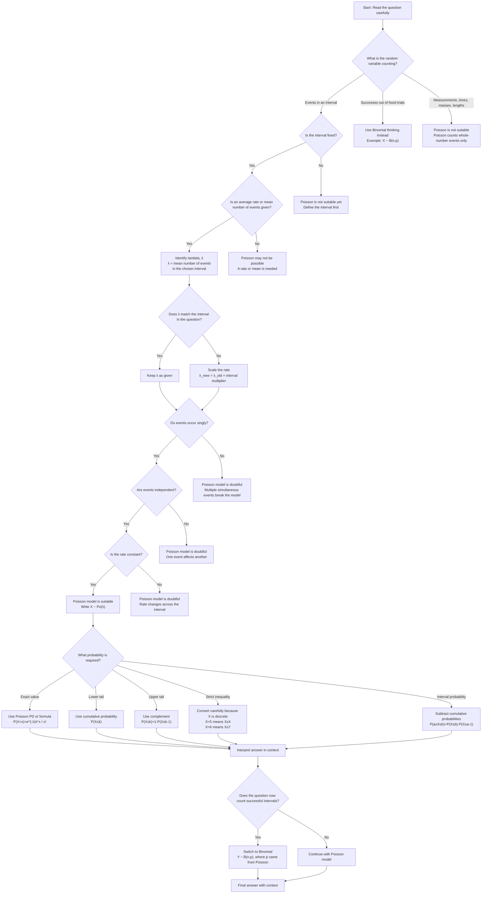

# Mermaid Asset: FAS2PoissonDistributionMermaid-001

## Asset metadata

| Field | Value |
|---|---|
| Asset ID | `FAS2PoissonDistributionMermaid-001` |
| Topic ID | `FAS2PoissonDistribution` |
| Unit | `FAS2`: Further AS 2 Applied Mathematics |
| Applied section | Section C: Statistics |
| Topic code | `FAS2-DIST` |
| Topic name | Statistical distributions: Poisson Distribution |
| Related lesson file | `FAS2_poisson_distribution_lesson.md` |
| Related lesson section | Section 9: Visual Asset Integration; Section 8.9: Modelling assumptions; Section 8.10: Deciding whether Poisson is suitable |
| Source | CCEA FAS2-DIST boundary + lesson evidence from `FS1-Chp2-PoissonDistribution.pdf` and `transcripts.md` |
| Used placeholder | `[VISUAL PLACEHOLDER: FAS2PoissonDistributionMermaid-001 | Source: CCEA FAS2-DIST boundary + lesson evidence | Insert from mermaid/FAS2PoissonDistributionMermaid-001.md | Purpose: Decision flowchart for choosing Poisson: count variable, fixed interval, average rate, singly, independently, constant rate.]` |
| Purpose | Decision flowchart for choosing whether a Poisson distribution is suitable. |
| Status | Generated in Phase 2 |

## Creation notes

This Mermaid diagram is designed as a syllabus-bound model-selection flowchart.

It checks the key Poisson modelling conditions preserved in the lesson:

1. The random variable counts events.
2. The events occur in a fixed interval of time, length, area, volume or space.
3. An average rate or mean number of events is known.
4. The rate can be scaled to match the interval in the question.
5. Events occur singly.
6. Events occur independently.
7. Events occur at a constant rate.

The diagram also preserves the lesson warning that a question may switch from Poisson to Binomial if the random variable changes from counting events to counting successful intervals.

## Mermaid code

## Accessibility notes

- The diagram is text-first and does not rely on colour.
- Every decision node is written as a question.
- Every terminal warning gives the reason Poisson may be unsuitable.
- The flow explicitly separates Poisson event-counting from Binomial fixed-trial counting.
