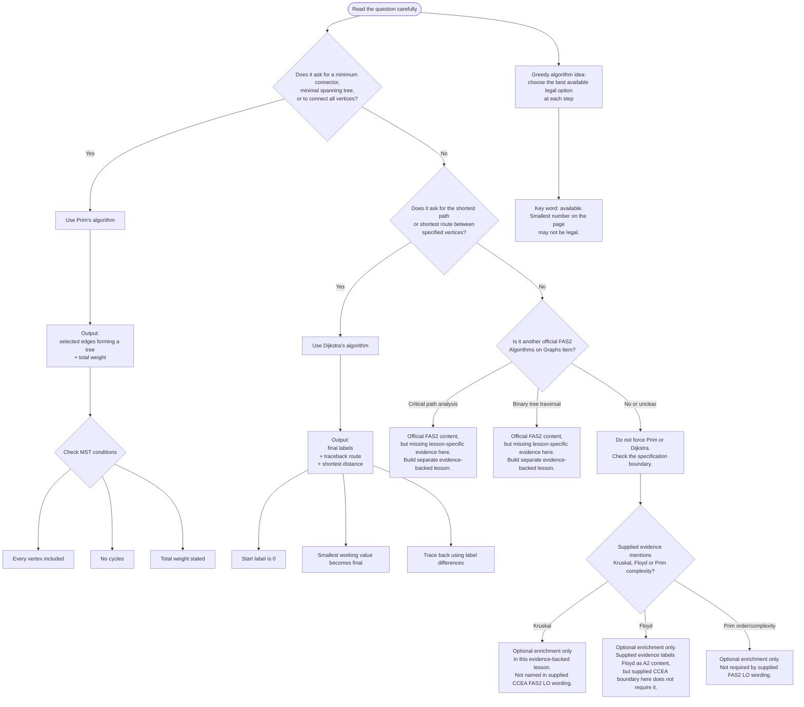

# FAS2AlgorithmsOnGraphsMermaid-001

## Asset Metadata

| Field | Entry |
|---|---|
| Asset ID | `FAS2AlgorithmsOnGraphsMermaid-001` |
| Asset type | Mermaid diagram |
| Related lesson file | `FAS2_algorithms_on_graphs_lesson.md` |
| Related lesson section | Section 9: Visual Asset Integration |
| Used placeholder | `[VISUAL PLACEHOLDER: FAS2AlgorithmsOnGraphsMermaid-001 | Source: CCEA FAS2 Algorithms on Graphs specification + supplied lesson evidence | Insert from mermaid/FAS2AlgorithmsOnGraphsMermaid-001.md | Purpose: Decision flow for choosing Prim’s algorithm or Dijkstra’s algorithm.]` |
| Source | CCEA FAS2 Algorithms on Graphs specification boundary + supplied Decision 1 Algorithms on Graphs evidence |
| Purpose | Help students choose the correct algorithm before calculating. |
| Core CCEA content represented | Algorithm definition, greedy algorithm, Prim’s algorithm, Dijkstra’s algorithm |
| Boundary content flagged | Kruskal’s algorithm, Floyd’s algorithm, Prim’s order/complexity proof |
| Status | Written to file. |

## Creation Notes

This diagram supports the first exam decision in the lesson: use Prim’s algorithm for minimum connector/minimal spanning tree questions, use Dijkstra’s algorithm for shortest-path questions, separate official missing FAS2 content, and keep Kruskal/Floyd/Prim complexity as enrichment only for this evidence-backed lesson.

## Mermaid Code

## Accessibility Description

This flowchart begins with reading the question carefully. It checks whether the task is a minimum connector/minimal spanning tree problem, in which case Prim’s algorithm is used, or a shortest-route problem, in which case Dijkstra’s algorithm is used. It also marks critical path analysis and binary tree traversal as official FAS2 content requiring separate evidence, and Kruskal/Floyd/Prim complexity as enrichment only for this lesson.

## Student-Facing Caption

Use this diagram before calculating. The first mark-saving move is choosing the correct algorithm: **Prim connects everything**, while **Dijkstra finds a shortest route**.
