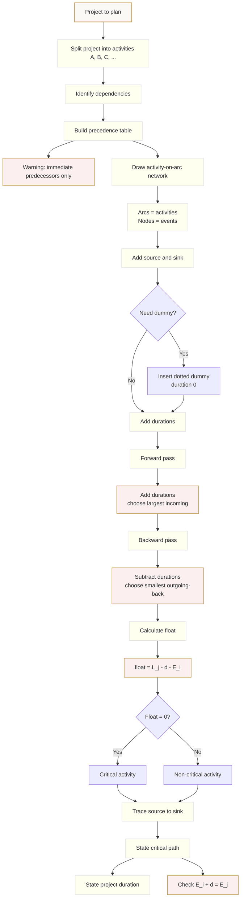

# FAS2CriticalPathAnalysisMermaid-001

## Asset Metadata

| Field | Value |
|---|---|
| Asset ID | FAS2CriticalPathAnalysisMermaid-001 |
| Asset type | Mermaid diagram |
| Unit | FAS2: Further AS 2 Applied Mathematics |
| Applied section | Section D: Discrete and Decision Mathematics |
| Topic code | FAS2-ALGGRAPH |
| Topic name | Critical Path Analysis |
| Topic ID | FAS2CriticalPathAnalysis |
| Related lesson file | FAS2_critical_path_analysis_lesson.md |
| Related lesson section | Section 9: Visual Asset Integration |
| Used placeholder | `[VISUAL PLACEHOLDER: FAS2CriticalPathAnalysisMermaid-001 | Source: CCEA FAS2 critical path analysis LO + uploaded CPA slides/transcript | Insert from mermaid/FAS2CriticalPathAnalysisMermaid-001.md | Purpose: Show the overall critical path analysis workflow from project activities to precedence table, activity network, event times, float and critical path.]` |
| Source | CCEA FAS2 critical path analysis LO + uploaded CPA slides/transcript |
| Purpose | Show the overall CPA workflow. |
| Status | Written file. |

