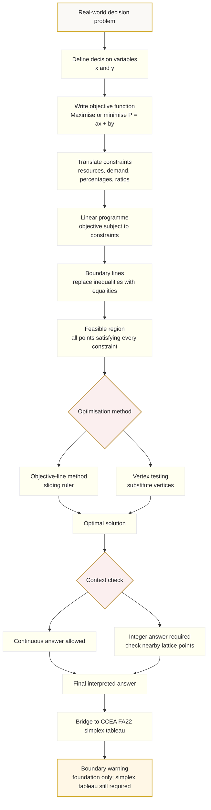

# FA22LinearProgrammingFoundationsMermaid-001

```mermaid
flowchart TD
    A["Real-world decision problem"] --> B["Define decision variables<br/>x and y"]
    B --> C["Write objective function<br/>Maximise or minimise P = ax + by"]
    C --> D["Translate constraints<br/>resources, demand, percentages, ratios"]
    D --> E["Linear programme<br/>objective subject to constraints"]
    E --> F["Boundary lines<br/>replace inequalities with equalities"]
    F --> G["Feasible region<br/>all points satisfying every constraint"]
    G --> H{"Optimisation method"}
    H --> I["Objective-line method<br/>sliding ruler"]
    H --> J["Vertex testing<br/>substitute vertices"]
    I --> K["Optimal solution"]
    J --> K
    K --> L{"Context check"}
    L --> M["Continuous answer allowed"]
    L --> N["Integer answer required<br/>check nearby lattice points"]
    M --> O["Final interpreted answer"]
    N --> O
    O --> P["Bridge to CCEA FA22 simplex tableau"]
    P --> Q["Boundary warning<br/>foundation only; simplex tableau still required"]

    classDef start fill:#FAF9F6,stroke:#D4AF37,color:#2C2C2E,stroke-width:2px;
    classDef process fill:#FFFFF0,stroke:#E5E5EA,color:#2C2C2E,stroke-width:1px;
    classDef decision fill:#FBEFEF,stroke:#C5A059,color:#2C2C2E,stroke-width:2px;
    classDef warning fill:#FFF7E6,stroke:#D4AF37,color:#2C2C2E,stroke-width:2px;
    class A start;
    class B,C,D,E,F,G,I,J,K,M,N,O,P process;
    class H,L decision;
    class Q warning;
```
