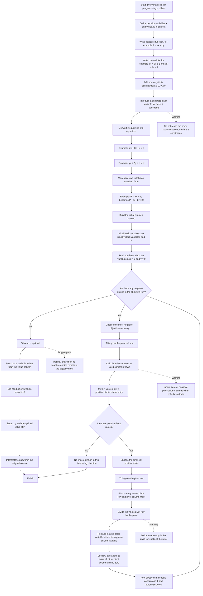

# Mermaid Asset: FA22SimplexAlgorithmTableauMermaid-001

## Asset metadata

| Field | Value |
|---|---|
| Asset ID | FA22SimplexAlgorithmTableauMermaid-001 |
| Unit | FA22: Further A2 2 Applied Mathematics |
| Applied section | Section D: Discrete and Decision Mathematics |
| Topic code | FA22-ALGGRAPH |
| Topic ID | FA22SimplexAlgorithmTableau |
| Related LO | FA22-ALGGRAPH-LO003 |
| Related lesson file | FA22_simplex_algorithm_tableau_lesson.md |
| Related lesson section | #9. Visual Asset Integration |
| Used placeholder | `[VISUAL PLACEHOLDER: FA22SimplexAlgorithmTableauMermaid-001 | Source: CCEA FA22-ALGGRAPH-LO003 + Decision 1 simplex tableau evidence + teacher transcript | Insert from mermaid/FA22SimplexAlgorithmTableauMermaid-001.md | Purpose: Show the full two-variable simplex tableau algorithm as a decision flow.]` |
| Source | CCEA FA22-ALGGRAPH-LO003 + Decision 1 simplex tableau evidence + teacher transcript |
| Purpose | Show the full two-variable simplex tableau algorithm as a decision flow. |
| Creation status | Generated in Phase 2 |
| On-spec status | Core CCEA Further Mathematics content, restricted to two-variable linear programming problems. |

## Creation notes

This Mermaid flowchart represents the simplex tableau algorithm for two-variable CCEA FA22 linear programming problems.

It deliberately excludes:

- three-variable simplex;
- four-variable simplex;
- integer solutions;
- two-stage simplex;
- Big-M method;
- artificial variables.

The algorithm follows the lesson convention:

\[
P=ax+by
\]

is rewritten as

\[
P-ax-by=0.
\]

For a maximisation tableau, the pivot column is selected from the most negative entry in the objective row.

Theta values are calculated only from rows with a positive pivot-column entry:

\[
\theta=\frac{\text{value entry}}{\text{positive pivot-column entry}}.
\]

The tableau is optimal when no negative entries remain in the objective row.

## Mermaid code



## Accessibility description

The diagram is a top-to-bottom flowchart of the simplex tableau process.

It begins with a two-variable linear programming problem, then moves through:

1. defining \(x\) and \(y\);
2. writing objective and constraints;
3. adding slack variables;
4. forming the tableau;
5. checking the objective row;
6. selecting pivot column and pivot row;
7. performing row operations;
8. repeating until optimal;
9. reading and interpreting the solution.

The warning branches highlight the most common exam traps:

- reusing slack variables;
- using invalid theta values;
- dividing only part of the pivot row;
- stopping before the objective row is non-negative.

## Lesson integration note

This asset should be inserted in Section 9 of:

```text
FA22_simplex_algorithm_tableau_lesson.md
```

at the placeholder:

```text
[VISUAL PLACEHOLDER: FA22SimplexAlgorithmTableauMermaid-001 | Source: CCEA FA22-ALGGRAPH-LO003 + Decision 1 simplex tableau evidence + teacher transcript | Insert from mermaid/FA22SimplexAlgorithmTableauMermaid-001.md | Purpose: Show the full two-variable simplex tableau algorithm as a decision flow.]
```
