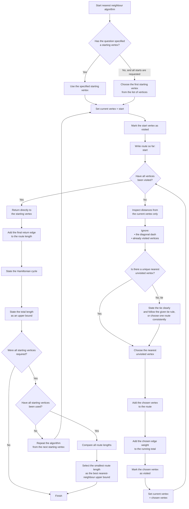

# FA22TravellingSalesmanProblemMermaid-001

Student warning: nearest neighbour chooses the nearest unvisited vertex from the current vertex only. It does not choose the smallest unused edge in the whole table, and it is not Prim’s algorithm.
