# FAS2AlgorithmsOnGraphsMermaid-001

## Asset Metadata

| Field | Value |
|---|---|
| Asset ID | FAS2AlgorithmsOnGraphsMermaid-001 |
| Asset type | Mermaid diagram |
| Unit | FAS2: Further AS 2 Applied Mathematics |
| Applied section | Section D: Discrete and Decision Mathematics |
| Topic code | FAS2-ALGGRAPH |
| Topic name | Algorithms on graphs |
| Topic ID | FAS2AlgorithmsOnGraphs |
| Related lesson file | FAS2_algorithms_on_graphs_lesson.md |
| Related lesson section | Section 9: Visual Asset Integration |
| Used placeholder | FAS2AlgorithmsOnGraphsMermaid-001 |
| Source | CCEA FAS2-ALGGRAPH specification boundary + lesson evidence |
| Purpose | Show how LO001 algorithm understanding sits before later graph algorithms. |

## Mermaid Diagram

```mermaid
flowchart TD
    A["FAS2-ALGGRAPH<br/>Algorithms on graphs"] --> B["LO001<br/>Understand algorithm definition<br/>including greedy algorithm"]
    B --> C["Algorithm structure"]
    C --> C1["Input"]
    C --> C2["Instructions"]
    C --> C3["Variables"]
    C --> C4["Decisions"]
    C --> C5["Loops"]
    C --> C6["Termination"]
    C --> C7["Output"]

    B --> D["Representation skills"]
    D --> D1["List of instructions"]
    D --> D2["Flow chart"]
    D --> D3["Trace table"]
    D --> D4["Code or pseudocode"]

    B --> E["Interpretation skills"]
    E --> E1["Follow steps in order"]
    E --> E2["Update variables carefully"]
    E --> E3["Take correct branch"]
    E --> E4["State final output"]
    E --> E5["Explain purpose"]

    B --> F["Greedy algorithm vocabulary"]
    F --> F1["Locally best permitted choice"]
    F --> F2["Fixed rule at each stage"]
    F --> F3["Not guessing final answer"]

    B --> G["Later FAS2 graph algorithms"]
    G --> H["LO002 Critical path analysis"]
    G --> I["LO003 Prim's algorithm"]
    G --> J["LO004 Breadth/depth first traversal"]
    G --> K["LO005 Dijkstra's algorithm"]
    H -. "Not taught in this foundation lesson" .-> L["Requires later evidence"]
    I -. "Not taught in this foundation lesson" .-> L
    J -. "Not taught in this foundation lesson" .-> L
    K -. "Not taught in this foundation lesson" .-> L
```

