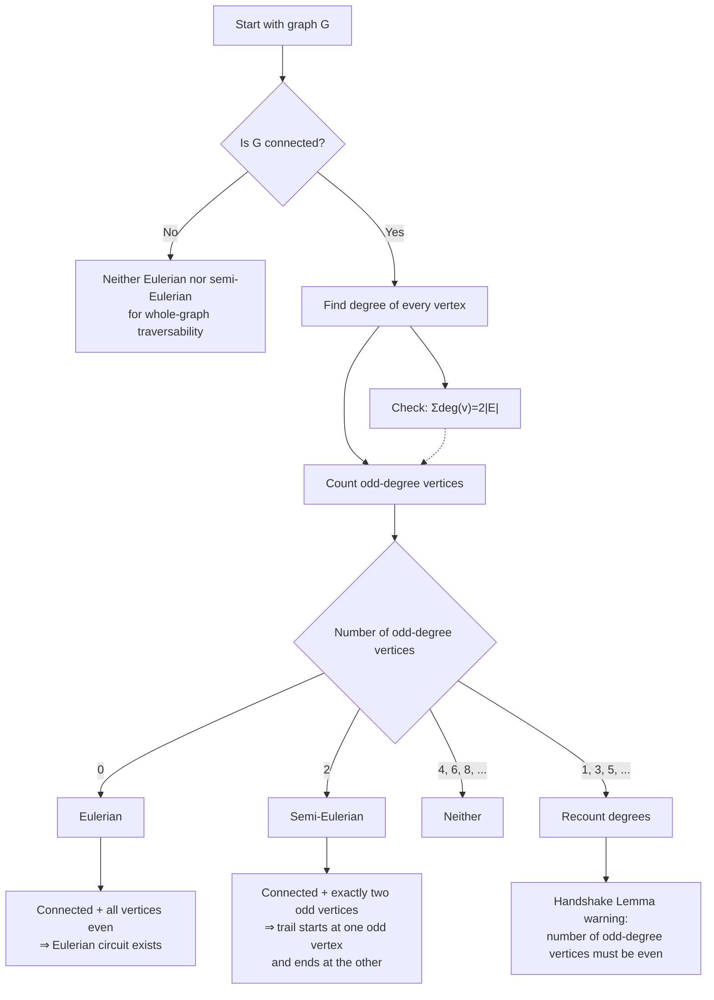

# FAS2EulerianTraversabilityAndRouteInspectionMermaid-001

```mermaid
flowchart TD
    A["Start with graph G"] --> B{"Is G connected?"}
    B -- "No" --> C["Neither Eulerian nor semi-Eulerian<br/>for whole-graph traversability"]
    B -- "Yes" --> D["Find degree of every vertex"]
    D --> E["Count odd-degree vertices"]
    E --> F{"Number of odd-degree vertices"}
    F -- "0" --> G["Eulerian"]
    G --> G1["Connected + all vertices even<br/>⇒ Eulerian circuit exists"]
    F -- "2" --> H["Semi-Eulerian"]
    H --> H1["Connected + exactly two odd vertices<br/>⇒ trail starts at one odd vertex<br/>and ends at the other"]
    F -- "4, 6, 8, ..." --> I["Neither"]
    F -- "1, 3, 5, ..." --> J["Recount degrees"]
    J --> J1["Handshake Lemma warning:<br/>number of odd-degree vertices must be even"]
    D --> K["Check: Σdeg(v)=2|E|"]
    K -.-> E
```
