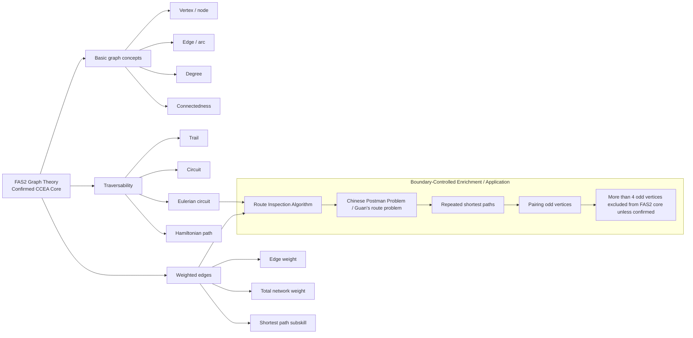

# FAS2EulerianTraversabilityAndRouteInspectionMermaid-002

```mermaid
flowchart LR
    A["FAS2 Graph Theory<br/>Confirmed CCEA Core"] --> B["Basic graph concepts"]
    B --> B1["Vertex / node"]
    B --> B2["Edge / arc"]
    B --> B3["Degree"]
    B --> B4["Connectedness"]
    A --> C["Traversability"]
    C --> C1["Trail"]
    C --> C2["Circuit"]
    C --> C3["Eulerian circuit"]
    C --> C4["Hamiltonian path"]
    A --> D["Weighted edges"]
    D --> D1["Edge weight"]
    D --> D2["Total network weight"]
    D --> D3["Shortest path subskill"]
    subgraph ENRICH["Boundary-Controlled Enrichment / Application"]
      H["Route Inspection Algorithm"]
      H1["Chinese Postman Problem / Guan's route problem"]
      H2["Repeated shortest paths"]
      H3["Pairing odd vertices"]
      H4["More than 4 odd vertices excluded from FAS2 core unless confirmed"]
    end
    C3 --> H
    D --> H
    H --> H1 --> H2 --> H3 --> H4
```
