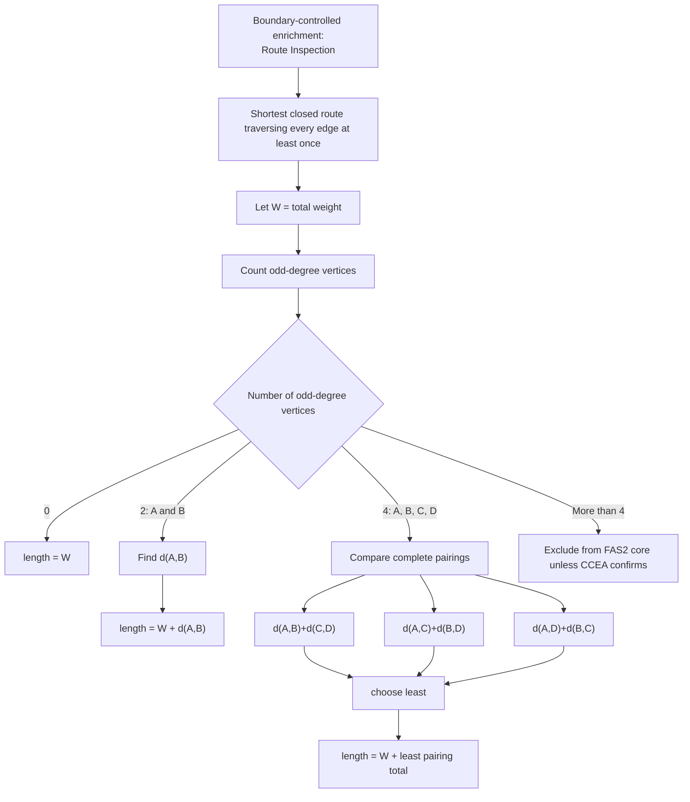

# FAS2EulerianTraversabilityAndRouteInspectionMermaid-003

```mermaid
flowchart TD
    A["Boundary-controlled enrichment:<br/>Route Inspection"] --> B["Shortest closed route traversing every edge at least once"]
    B --> C["Let W = total weight"]
    C --> D["Count odd-degree vertices"]
    D --> E{"Number of odd-degree vertices"}
    E -- "0" --> F["length = W"]
    E -- "2: A and B" --> G["Find d(A,B)"]
    G --> G1["length = W + d(A,B)"]
    E -- "4: A, B, C, D" --> H["Compare complete pairings"]
    H --> H1["d(A,B)+d(C,D)"]
    H --> H2["d(A,C)+d(B,D)"]
    H --> H3["d(A,D)+d(B,C)"]
    H1 --> H4["choose least"]
    H2 --> H4
    H3 --> H4
    H4 --> H5["length = W + least pairing total"]
    E -- "More than 4" --> I["Exclude from FAS2 core unless CCEA confirms"]
```
