# Mermaid Asset: FAS2GraphTheoryMermaid-001

## Asset Metadata

```yaml
asset_id: FAS2GraphTheoryMermaid-001
unit_code: FAS2
topic_code: FAS2-GRAPH
topic_name: Graph theory
topic_id: FAS2GraphTheory
asset_type: mermaid
related_lesson_file: FAS2_graph_theory_lesson.md
related_lesson_section: Section 9. Visual Asset Integration; Section 8. Core Theory
used_placeholder: "[VISUAL PLACEHOLDER: FAS2GraphTheoryMermaid-001 | Source: CCEA FAS2-GRAPH specification + uploaded lesson evidence | Insert from mermaid/FAS2GraphTheoryMermaid-001.md | Purpose: Show how the graph theory vocabulary branches from graph, network, traversability, special graphs and trees.]"
source:
  - CCEA FAS2-GRAPH specification boundary
  - Uploaded teacher transcript: Chapter 2 Graphs & Networks
  - Uploaded lesson PDF: Decision Maths 1 chapter 2 Graphs and networks
purpose: "Show how the required graph theory vocabulary connects."
```

## Mermaid Code

```mermaid
flowchart TD
    A["Graph Theory<br/>FAS2-GRAPH"]:::root
    A --> B["Graph<br/>G = (V, E)"]:::core
    B --> B1["Vertices / nodes"]:::def
    B --> B2["Edges / arcs"]:::def
    B --> B3["Subgraph"]:::def
    B --> B4["Planarity<br/>redraw without crossings except at vertices"]:::def
    B1 --> C["Degree / valency / order"]:::core
    C --> C1["Odd vertex"]:::def
    C --> C2["Even vertex"]:::def
    C --> C3["Handshaking lemma<br/>sum degrees = 2 × edges"]:::theorem
    C3 --> C4["Number of odd vertices is even"]:::warning
    B2 --> D["Weighted graph / network"]:::core
    D --> D1["Weights: distance, time, cost, delay"]:::example
    D --> D2["Not normally drawn to scale"]:::warning
    B2 --> E["Directed graph / digraph"]:::core
    A --> F["Traversability"]:::core
    F --> F1["Walk"]:::def
    F1 --> F2["Path<br/>no repeated vertices"]:::def
    F1 --> F3["Trail<br/>no repeated edges"]:::def
    F2 --> F4["Cycle<br/>closed path"]:::def
    F3 --> F5["Circuit<br/>closed trail"]:::def
    F5 --> F6["Eulerian circuit<br/>every edge exactly once"]:::core
    F2 --> F7["Hamiltonian path<br/>every vertex exactly once"]:::core
    F4 --> F8["Hamiltonian cycle<br/>related evidence term"]:::enrich
    A --> G["Basic graph families"]:::core
    G --> G1["Complete graph Kₙ<br/>edges n(n-1)/2"]:::core
    G --> G2["Complete bipartite graph Kₘ,ₙ<br/>edges mn"]:::core
    G --> G3["Star graph Sₙ<br/>central degree n"]:::core
    A --> H["Trees"]:::core
    H --> H1["Connectedness"]:::def
    H --> H2["Tree<br/>connected and no cycles"]:::core
    H2 --> H3["Spanning tree<br/>tree subgraph with all vertices"]:::core
    H2 --> H4["Rooted tree"]:::core
    H4 --> H5["Binary tree"]:::core
    A --> I["Bridge warning<br/>ordinary coordinate graph ≠ graph theory graph"]:::bridge
    I --> I1["No axes needed"]:::bridge
    I --> I2["Crossings are not vertices unless marked"]:::warning

    classDef root fill:#FAF9F6,stroke:#C5A059,stroke-width:3px,color:#2C2C2E;
    classDef core fill:#FFFFF0,stroke:#D4AF37,stroke-width:2px,color:#2C2C2E;
    classDef def fill:#FAF9F6,stroke:#E5E5EA,stroke-width:1.5px,color:#2C2C2E;
    classDef theorem fill:#FBEFEF,stroke:#C5A059,stroke-width:2px,color:#2C2C2E;
    classDef warning fill:#FBEFEF,stroke:#C5A059,stroke-width:2px,color:#2C2C2E;
    classDef example fill:#FFFFF0,stroke:#E5E5EA,stroke-width:1.5px,color:#2C2C2E;
    classDef enrich fill:#FAF9F6,stroke:#E5E5EA,stroke-dasharray:5 5,color:#2C2C2E;
    classDef bridge fill:#FAF9F6,stroke:#C5A059,stroke-dasharray:4 4,color:#2C2C2E;
```



## Boundary Notes

Core CCEA FAS2 content is included. Full planarity algorithm, adjacency/distance matrices, isomorphic graphs and FA22 graph colouring/matching content are excluded from this core map.
