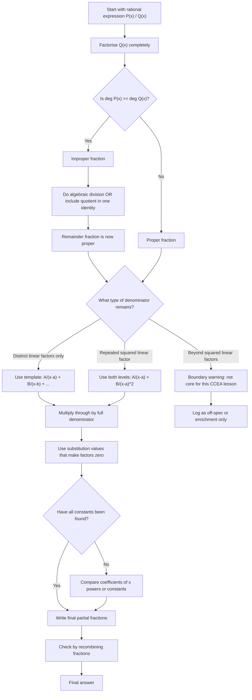

# A21AlgebraicMethodsPartialFractionsMermaid-001

## Asset ID

`A21AlgebraicMethodsPartialFractionsMermaid-001`

## Asset Type

Mermaid flowchart

## Source

- CCEA GCE Mathematics Specification Map: A21-AF-LO001 and A21-AF-LO008
- Dr Frost / Pure Year 2 transcript evidence on algebraic fractions, simple partial fractions, repeated linear factors and improper fractions
- Phase 1 placeholder:  
  `[VISUAL PLACEHOLDER: A21AlgebraicMethodsPartialFractionsMermaid-001 | Source: CCEA specification map + transcript | Insert from mermaid/A21AlgebraicMethodsPartialFractionsMermaid-001.md | Purpose: Flowchart for choosing between proper partial fractions, repeated linear factors and improper fractions.]`

## Related Lesson Section

- Core Theory
- Worked Examples
- Common Mistakes and Exam Traps
- Exam Technique Notes
- Visual and Interactive Asset Plan

## Purpose

Show the decision route for choosing the correct partial-fractions method:

1. factorise first;
2. check whether the fraction is proper or improper;
3. choose the correct denominator template;
4. stay inside the CCEA squared-linear-factor boundary;
5. use substitution, comparing coefficients or algebraic division as needed;
6. verify the final answer by recombining.

## Mermaid Code

