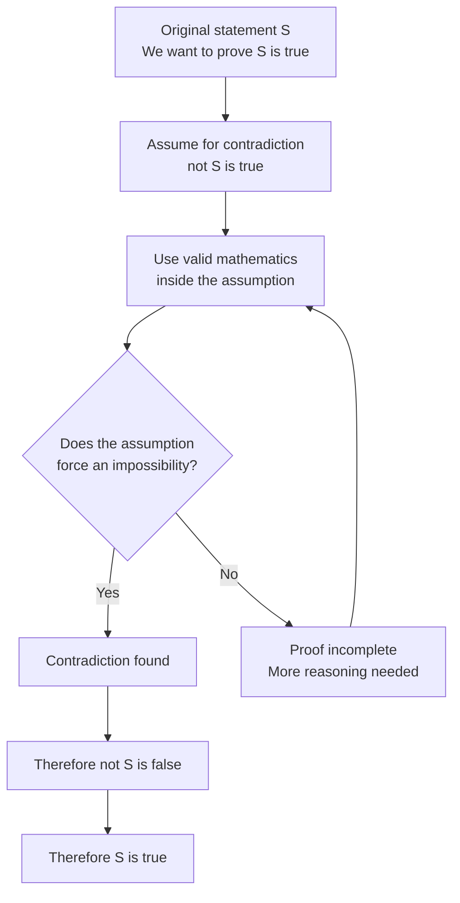

# Asset ID: A21AlgebraicMethodsProofByContradictionMermaid-001

## Source
- CCEA GCE Mathematics specification map: overarching proof and reasoning theme.
- Teacher transcript: proof by contradiction method.
- Dr Frost/Pearson-style lesson PDF: proof-by-contradiction structure.

## Related Lesson Section
Core Theory

## Purpose
Show the central proof-by-contradiction logic loop: assume the negation, derive a contradiction, reject the assumption, and conclude the original statement.

## Mermaid Diagram

