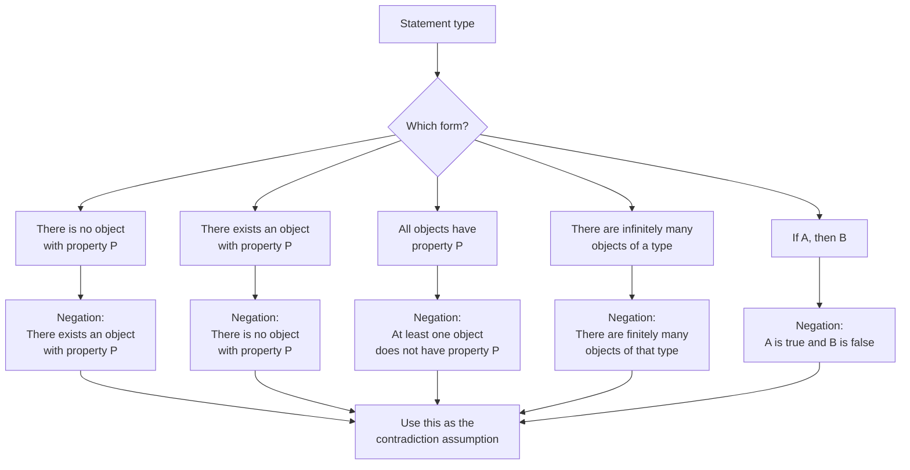

# Asset ID: A21AlgebraicMethodsProofByContradictionMermaid-002

## Source
- Dr Frost/Pearson-style negation slide.
- Phase 1 Key Definitions and Notation.
- Teacher transcript discussion of assuming the negation.

## Related Lesson Section
Key Definitions and Notation

## Purpose
Help students choose the correct negation before beginning a contradiction proof.

## Mermaid Diagram

