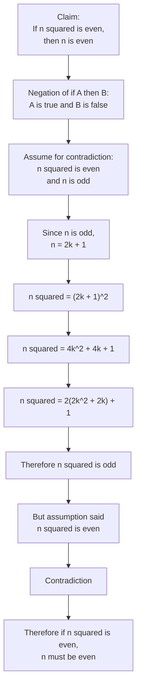

# Asset ID: A21AlgebraicMethodsProofByContradictionMermaid-003

## Source
- Teacher transcript worked example: if n squared is even, then n must be even.
- Dr Frost/Pearson-style slide example.

## Related Lesson Section
Worked Example 2

## Purpose
Show the conditional-statement structure for proving: if \(n^2\) is even, then \(n\) is even.

## Mermaid Diagram

