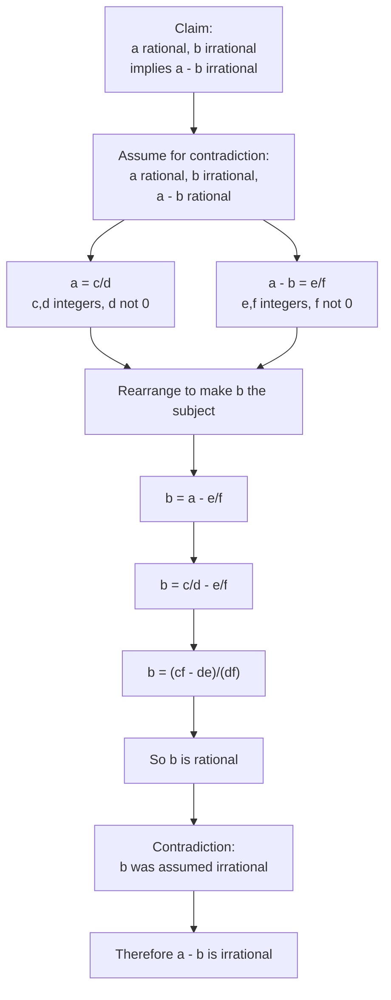

# Asset ID: A21AlgebraicMethodsProofByContradictionMermaid-004

## Source
- Teacher transcript worked example: given rational \(a\) and irrational \(b\), prove \(a-b\) is irrational.
- Phase 1 Worked Example 4.

## Related Lesson Section
Worked Example 4

## Purpose
Show the strategy for rational/irrational contradiction proofs.

## Mermaid Diagram

