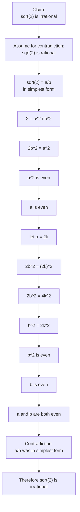

# Asset ID: A21AlgebraicMethodsProofByContradictionMermaid-005

## Source
- Teacher transcript worked example: prove \(\sqrt2\) is irrational.
- Dr Frost/Pearson-style slide proof.

## Related Lesson Section
Worked Example 5

## Purpose
Show the contradiction chain in the standard proof that \(\sqrt2\) is irrational.

## Mermaid Diagram

