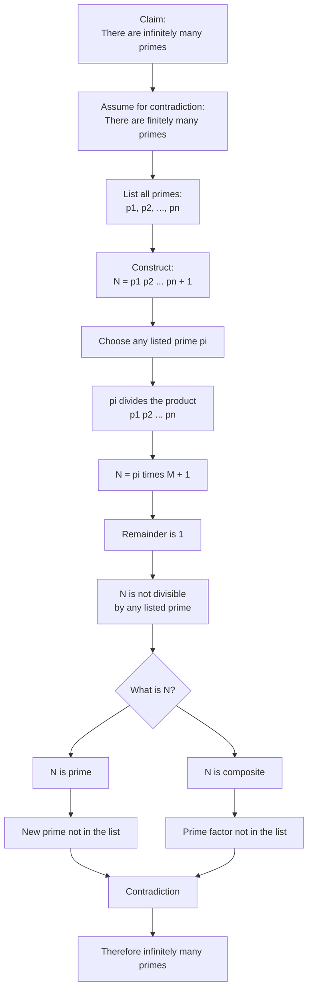

# Asset ID: A21AlgebraicMethodsProofByContradictionMermaid-006

## Source
- Teacher transcript and slide evidence for Euclid's proof that there are infinitely many prime numbers.
- Phase 1 Worked Example 6.

## Related Lesson Section
Worked Example 6

## Purpose
Show how assuming a finite list of all primes leads to \(N=p_1p_2\cdots p_n+1\), which cannot be divisible by any prime in the list.

## Mermaid Diagram

