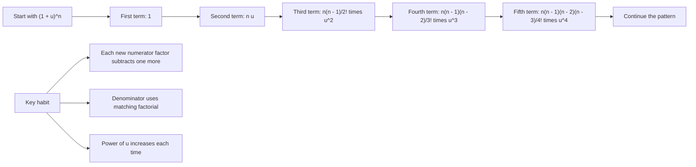

# A21BinomialExpansionMermaid-002

## Asset Metadata

| Field | Value |
|---|---|
| Asset ID | A21BinomialExpansionMermaid-002 |
| Unit | A21 |
| Topic code | A21-SS |
| Topic ID | A21BinomialExpansion |
| Source | CCEA specification map + Chapter 4 Binomial Expansion transcript + reveal-block PDF |
| Related lesson section | Coefficient Pattern |
| Purpose | Show the coefficient-building pattern used for rational, negative and fractional powers. |

## Mermaid Code

