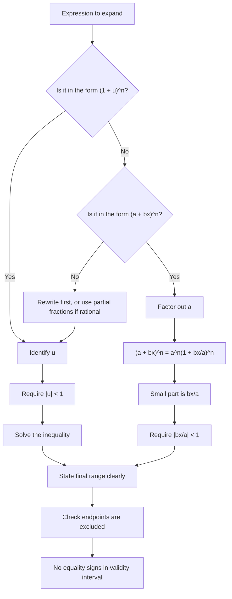

# A21BinomialExpansionMermaid-003

## Asset Metadata

| Field | Value |
|---|---|
| Asset ID | A21BinomialExpansionMermaid-003 |
| Unit | A21 |
| Topic code | A21-SS |
| Topic ID | A21BinomialExpansion |
| Source | CCEA specification map + Chapter 4 Binomial Expansion transcript + reveal-block PDF |
| Related lesson section | Validity Decision Flow |
| Purpose | Show how to decide the validity condition for an infinite binomial expansion. |

## Mermaid Code

