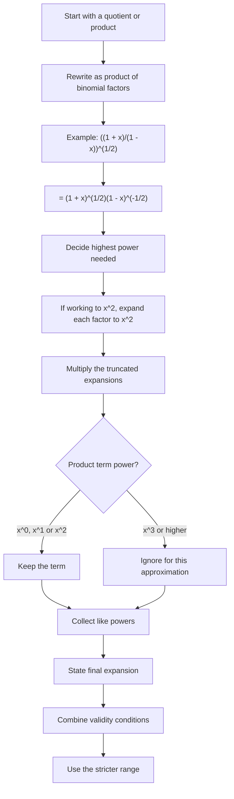

# A21BinomialExpansionMermaid-005

## Asset Metadata

| Field | Value |
|---|---|
| Asset ID | A21BinomialExpansionMermaid-005 |
| Unit | A21 |
| Topic code | A21-SS |
| Topic ID | A21BinomialExpansion |
| Source | CCEA specification map + Chapter 4 Binomial Expansion transcript + reveal-block PDF |
| Related lesson section | Combining Expansions |
| Purpose | Show how to multiply two binomial expansions and keep only the required powers of x. |

## Mermaid Code

