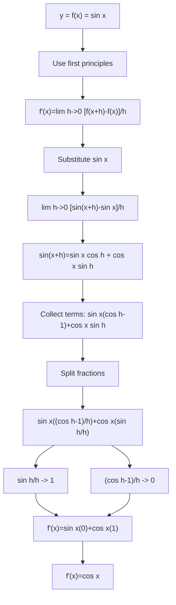

# A21DifferentiationMermaid-001

## Asset Metadata
- Asset ID: A21DifferentiationMermaid-001
- Source: Chapter 9 Differentiation transcript + slide PDF + CCEA A21-DIFF-LO001
- Related lesson section: Core Theory 1
- Purpose: Show proof pathway from first principles to \(d/dx(\sin x)=\cos x\).

