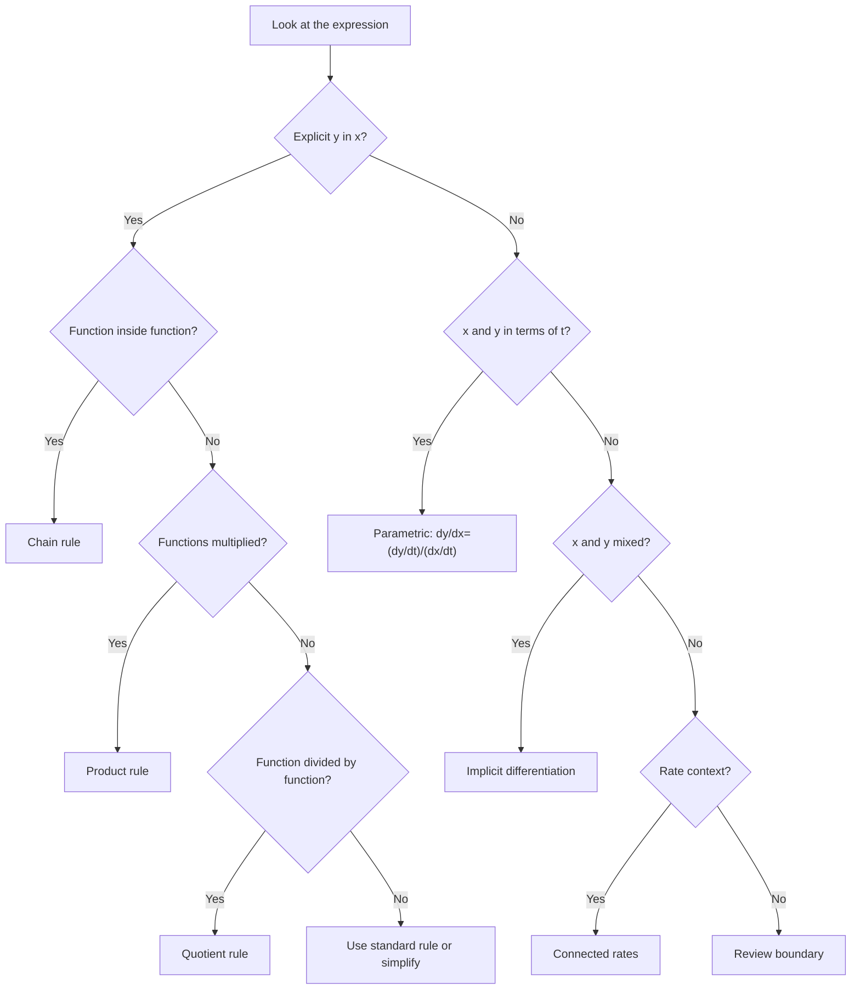

# A21DifferentiationMermaid-002

## Asset Metadata
- Asset ID: A21DifferentiationMermaid-002
- Source: CCEA A21-DIFF-LO002 + Chapter 9 transcript
- Related lesson section: Chain, Product and Quotient Rules
- Purpose: Rule-selection flowchart.

