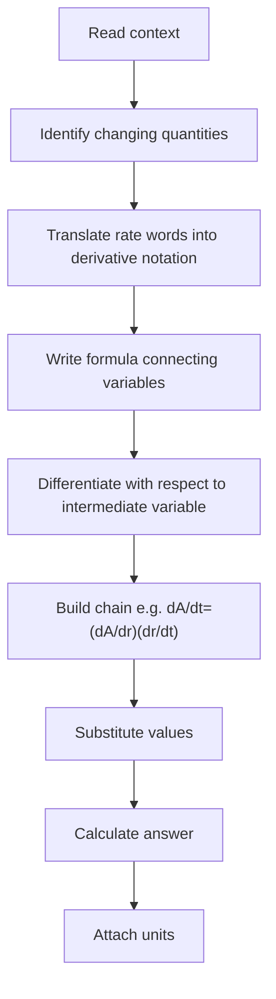

# A21DifferentiationMermaid-003

## Asset Metadata
- Asset ID: A21DifferentiationMermaid-003
- Source: Chapter 9 connected rates transcript + CCEA A21-DIFF-LO005
- Related lesson section: Connected Rates
- Purpose: Connected-rates workflow.

