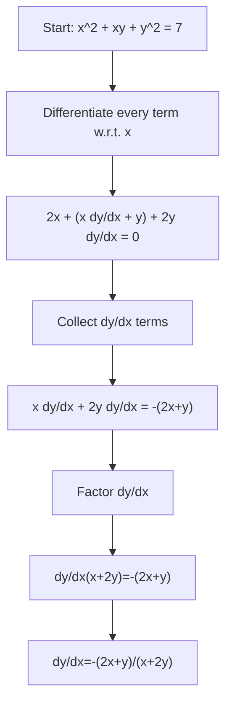

# A21DifferentiationMermaid-004

## Asset Metadata
- Asset ID: A21DifferentiationMermaid-004
- Source: Chapter 9 implicit differentiation transcript + CCEA A21-DIFF-LO004
- Related lesson section: Implicit Differentiation
- Purpose: Workflow for collecting \(dy/dx\) terms.

