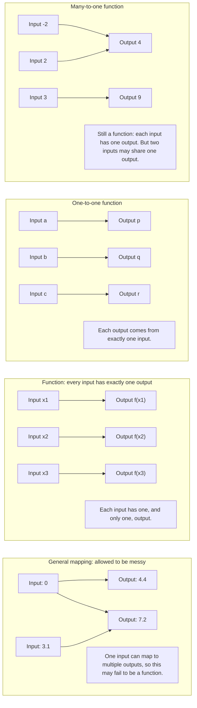

# A21FunctionsAndGraphsMER-001

## Asset Metadata

| Field | Value |
|---|---|
| Asset ID | `A21FunctionsAndGraphsMER-001` |
| Asset type | Mermaid diagram |
| Unit | A21: A2 1 Pure Mathematics |
| Topic code | A21-AF |
| Topic | Functions and Graphs |
| Related LO IDs | `A21-AF-LO002`, `A21-AF-LO003` |
| Related lesson section | Mappings, Functions, Domain and Range |
| Source | CCEA specification map; Chapter 2 Functions and Graphs transcript section on mappings/functions; P2 Chapter 2 slides on mapping, function, domain and range |
| Purpose | Compare a general mapping, a function, a one-to-one function and a many-to-one function. |
| Status | Final |

## Mermaid Code

