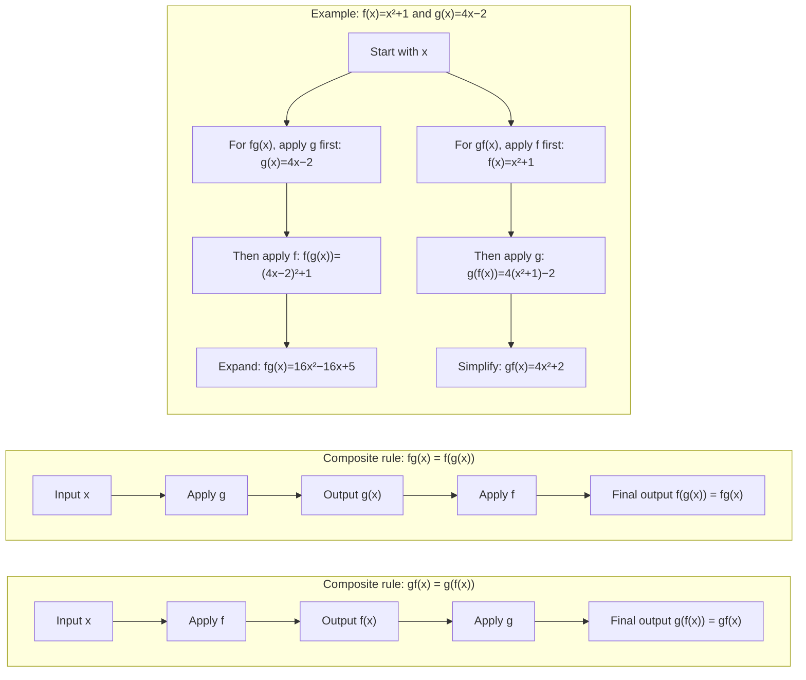

# A21FunctionsAndGraphsMER-002

## Asset Metadata

| Field | Value |
|---|---|
| Asset ID | `A21FunctionsAndGraphsMER-002` |
| Asset type | Mermaid diagram |
| Unit | A21: A2 1 Pure Mathematics |
| Topic code | A21-AF |
| Topic | Functions and Graphs |
| Related LO IDs | `A21-AF-LO004` |
| Related lesson section | Composite Functions |
| Source | CCEA specification map; Chapter 2 Functions and Graphs transcript section on composite functions; P2 Chapter 2 slides on composite functions |
| Purpose | Show that `gf(x)=g(f(x))` applies `f` first, then `g`, while `fg(x)=f(g(x))` applies `g` first, then `f`. |
| Status | Final |

## Mermaid Code

