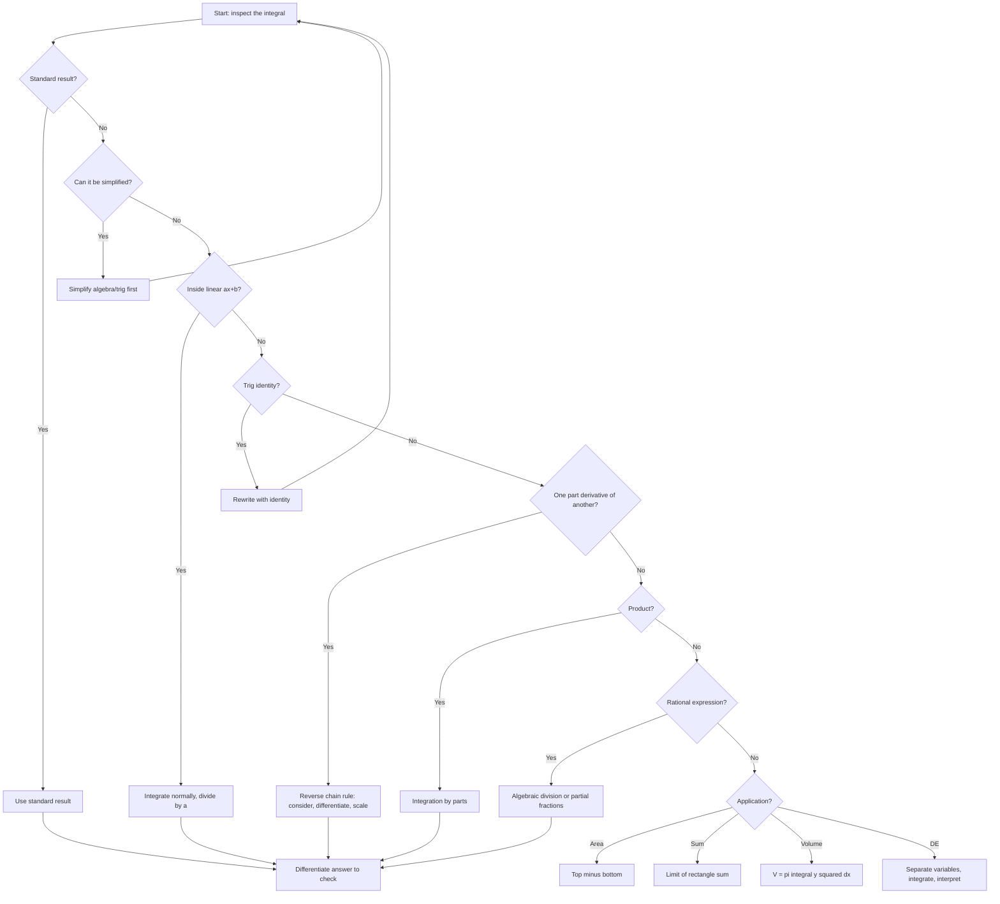

# A21IntegrationMermaid-001

## Asset Metadata

| Field | Value |
|---|---|
| Asset ID | A21IntegrationMermaid-001 |
| Asset type | Mermaid flowchart |
| Lesson | A21 Integration |
| Related section | Exam Technique Notes |
| Source | CCEA specification map + Chapter 11 lesson evidence |
| Purpose | Help students choose an integration method. |

