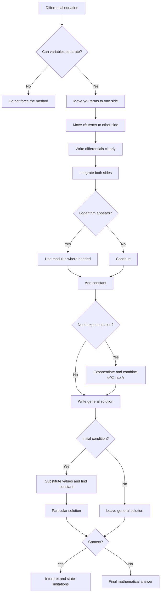

# A21IntegrationMermaid-002

## Asset Metadata

| Field | Value |
|---|---|
| Asset ID | A21IntegrationMermaid-002 |
| Asset type | Mermaid flowchart |
| Lesson | A21 Integration |
| Related section | Separable Differential Equations |
| Source | CCEA A21-INT-LO006/LO007 |
| Purpose | Show separable differential-equation workflow. |

