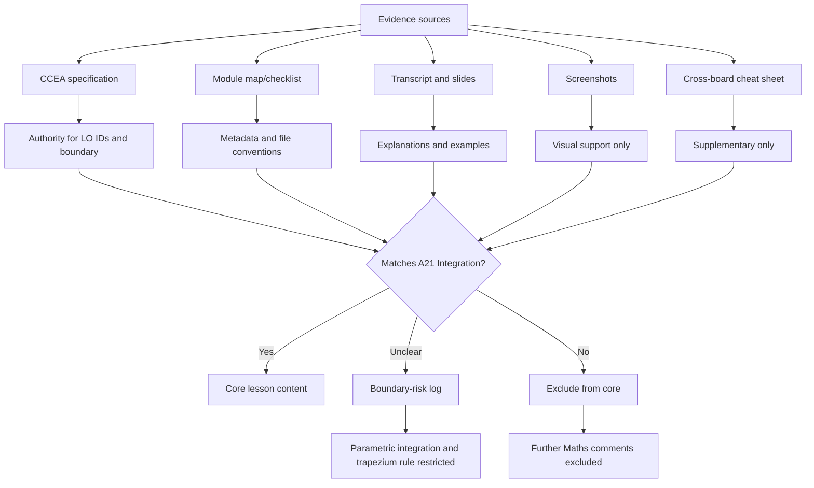

# A21IntegrationMermaid-003

## Asset Metadata

| Field | Value |
|---|---|
| Asset ID | A21IntegrationMermaid-003 |
| Asset type | Mermaid flowchart |
| Lesson | A21 Integration |
| Related section | Evidence Map and Syllabus Boundary |
| Source | Specification map, module map, checklist, lesson evidence |
| Purpose | Show evidence filtering through CCEA boundaries. |

