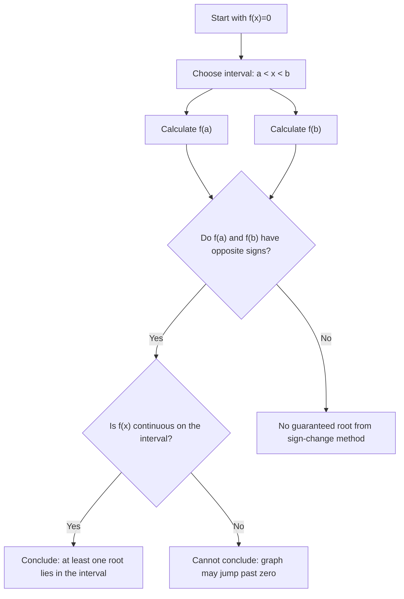

# A21NumericalMethodsMermaid-001_root_location_workflow

**Asset ID:** A21NumericalMethodsMermaid-001  
**Source:** CCEA specification map + Chapter 10 Numerical Methods evidence  
**Related lesson section:** A21 Numerical Methods lesson  
**Purpose:** Root-location workflow using sign change and continuity.

