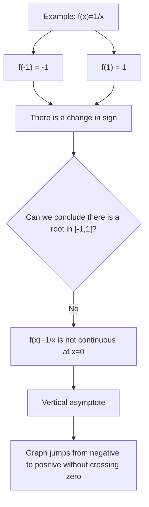

# A21NumericalMethodsMermaid-002_continuity_warning

**Asset ID:** A21NumericalMethodsMermaid-002  
**Source:** CCEA specification map + Chapter 10 Numerical Methods evidence  
**Related lesson section:** A21 Numerical Methods lesson  
**Purpose:** Continuity warning using f(x)=1/x.

