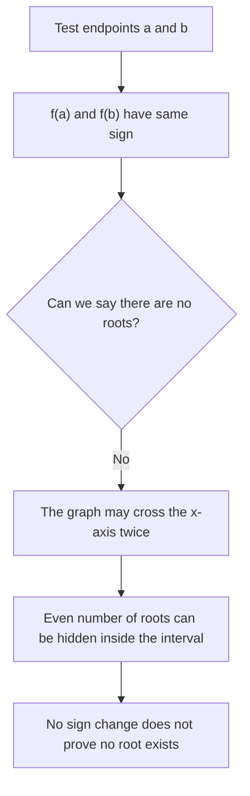

# A21NumericalMethodsMermaid-003_no_sign_change_warning

**Asset ID:** A21NumericalMethodsMermaid-003  
**Source:** CCEA specification map + Chapter 10 Numerical Methods evidence  
**Related lesson section:** A21 Numerical Methods lesson  
**Purpose:** No sign change does not prove no root.

