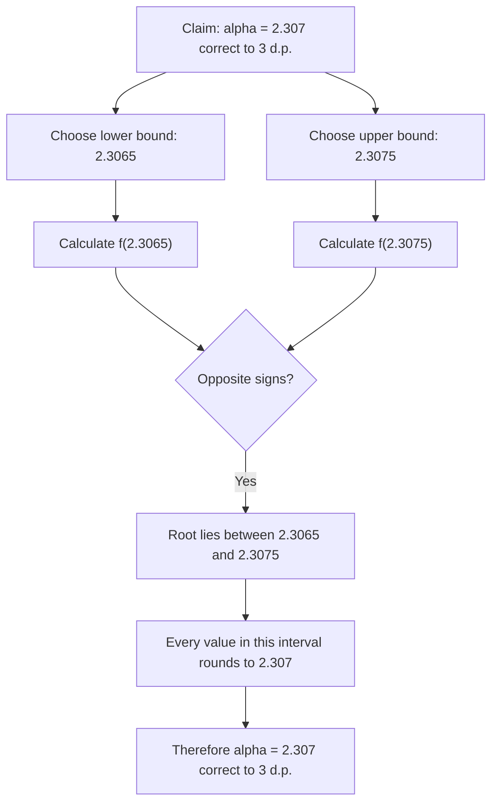

# A21NumericalMethodsMermaid-004_accuracy_interval_workflow

**Asset ID:** A21NumericalMethodsMermaid-004  
**Source:** CCEA specification map + Chapter 10 Numerical Methods evidence  
**Related lesson section:** A21 Numerical Methods lesson  
**Purpose:** Accuracy interval workflow.

