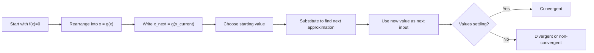

# A21NumericalMethodsMermaid-005_iteration_workflow

**Asset ID:** A21NumericalMethodsMermaid-005  
**Source:** CCEA specification map + Chapter 10 Numerical Methods evidence  
**Related lesson section:** A21 Numerical Methods lesson  
**Purpose:** Iteration workflow.

